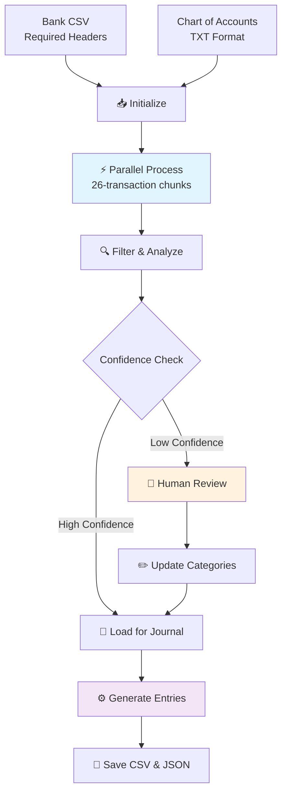

# 🧾 Accounting Assistant Agent

> **AI-powered accounting automation that transforms bank transactions into accurate journal entries**

A sophisticated multi-agent system built with Google's Agent Development Kit (ADK) that automates the essential accounting workflow: transaction categorization → journal entries.

---

## ✨ What It Does

🔄 **Categorizes bank transactions** using AI with confidence scoring  
📊 **Generates double-entry journal entries** that always balance  
⚡ **Processes data 3x faster** using parallel processing  
🎯 **Flags uncertain items** for human review  

---

## 🚀 Quick Start

### Prerequisites
- **Python 3.13**
- **Google API Key** ([Get one here](https://aistudio.google.com/app/apikey))

### 1. Setup
```bash
# Clone and navigate
git clone <repository-url>
cd accounting-assistant-agent

# Install dependencies  
uv sync
# or: pip install -e .

# Configure API key
echo "GOOGLE_API_KEY=your_api_key_here" > .env
```

### 2. Run the Agent
```bash
adk web
```

### 3. Try It Out
Update the paths below to match your system location, then copy this prompt into the web interface:
```
Categorize the transactions at 'data/transactions/Sample Bank Export.csv'

The Chart of Account is saved at 'data/transactions/COA.txt'

Show the transaction_id for the flagged transactions
```

> 💡 **Requirements**:
> - Use relative paths from the project root directory
> - Ensure your transaction CSV file has **Date**, **Description**, and **Amount** columns in the headers
> - Make sure your Chart of Accounts is in **TXT format**

### 4. Find Your Results
After the agent completes processing, your journal entries will be saved in:

📁 **Location**: `data/output/` (in your project directory)

📄 **Files created**:
- **`journal_entries_journal_YYYYMMDD_HHMMSS_xxxxxxxx.csv`** - Journal entries in CSV format
- **`journal_entries_journal_YYYYMMDD_HHMMSS_xxxxxxxx.json`** - Detailed report with metadata and summaries

💼 **What to do with the files**:
- **CSV file**: Contains double-entry journal entries (modifications may be needed for your specific accounting software)
- **JSON file**: Review for detailed transaction analysis and confidence scores

⚠️ **Important Notes**:
- This project is **not designed for direct compatibility** with specific accounting software - you may need to modify the CSV output format
- The bank export format used here is **simplified for code sharing purposes** - you can adjust the CSV parsing logic to match your bank's specific export format

> 📍 **Example**: Look for files like `journal_entries_journal_20250724_144758_11b7ae41.csv` in your `data/output/` folder

---

## 🏗️ How It Works

### Multi-Agent Architecture
The system uses **2 sophisticated workflows**, each with **3 specialized sub-agents**:

#### 🔍 Transaction Categorizer (SequentialAgent)
| Sub-Agent | Purpose | Key Features |
|-----------|---------|--------------|
| **📥 Initialization** | File loading & validation | • Chart of Accounts: TXT format only<br>• Bank transactions: CSV format with required headers<br>• Creates 26-transaction chunks<br>• Validates data integrity |
| **⚡ Parallel Processing** | AI-powered categorization | • ThreadPoolExecutor concurrency<br>• Account code validation<br>• Confidence scoring (0.0-1.0) |
| **🔍 Filtering** | Results analysis | • Low confidence flagging<br>• Account usage statistics<br>• Review recommendations |

#### 📝 Journal Generator (SequentialAgent)  
| Sub-Agent | Purpose | Key Features |
|-----------|---------|--------------|
| **📂 Initialization** | Load categorized data | • Finds latest JSONL files<br>• Session state management<br>• Data validation |
| **⚙️ Processing** | Double-entry conversion | • Cash account (1000) handling<br>• Debit/Credit rule application<br>• Balance validation |
| **💾 Output** | File generation | • CSV for accounting software<br>• JSON with metadata<br>• Account summaries |

### The Process Flow


---

## 📁 Project Structure

```
accounting-assistant-agent/
├── 📦 acc_agent/                         # Main agent system
│   ├── 🤖 agent.py                      # Root orchestrator with session management
│   ├── 📝 prompt.py                     # System prompts & instructions
│   ├── 🛠️  tools.py                     # Core utilities (CSV/JSON handling, validation)
│   └── 🔧 sub_agents/                   # Specialized agent workflows
│       ├── 📊 categorizer/              # Transaction categorization pipeline
│       │   ├── agent.py                 # SequentialAgent coordinator
│       │   └── subagents/               # 3-stage pipeline
│       │       ├── initialization/      # File loading & validation
│       │       ├── parallel_processing/ # Concurrent AI categorization  
│       │       └── filtering/           # Confidence analysis & review
│       └── 📝 journal_generator/        # Journal entry generation pipeline
│           ├── agent.py                 # SequentialAgent coordinator
│           ├── tools.py                 # Double-entry bookkeeping logic
│           └── subagents/               # 3-stage pipeline
│               ├── initialization/      # Load categorized data
│               ├── processing/          # Generate balanced entries
│               └── output/              # Format & save files
├── 📊 data/                             # Data directory
│   ├── 📁 transactions/                 # Input files
│   │   ├── COA.txt                     # Chart of Accounts
│   │   └── Sample*.csv  # Sample bank exports (79 transactions)
│   └── 📁 output/                       # Generated results
│       ├── categorization_results_*.jsonl  # Categorized transactions with confidence
│       ├── journal_entries_*.csv        # Double-entry journal entries  
│       └── journal_entries_*.json       # Detailed reports with metadata
├── 📋 pyproject.toml                    # Dependencies & project config
└── 📄 main.py                           # Simple entry point
```

---

## 🎯 Key Features

### ⚡ Parallel Processing
- **Traditional**: ~5 minutes (sequential)  
- **This system**: ~2 minutes (parallel)  
- **3x speed improvement** using concurrent API calls

### 🎯 Confidence Scoring
Transactions get scored to guide your review:
- **🟢 90-100%**: High confidence, likely correct
- **🟡 70-89%**: Medium confidence, probably right  
- **🔴 <70%**: Low confidence, needs human review

### 🔄 Session Management
- ✅ Resume interrupted workflows
- ✅ Update categorizations after processing  
- ✅ Track all changes with timestamps

---

## 📋 Input & Output Formats

### Chart of Accounts
**Required TXT format:**
```text
1000: Cash and Cash Equivalents
1100: Accounts Receivable  
5100: Salaries and Wages Expense
6900: Other Expenses
```

### Bank Export CSV
Required columns (case-insensitive):
- `Date` - Transaction date (various formats supported)
- `Description` - Transaction description
- `Amount` - Dollar amount (positive for deposits, negative for payments)
- `Memo` - Additional details (optional, combined with Description)

**Sample data (included in project):**
```csv
Date,Post Date,Description,Category,Type,Amount,Memo
1/5/25,1/5/25,DEPOSIT - WIRE TRANSFER,Wire Transfer,Deposit,250000,CAPITAL CONTRIBUTION
1/25/25,1/25/25,PAYROLL RUN - GUSTO,ACH Payment,ACH Payment,-18550.75,GUSTO PAYROLL BATCH#P12345
1/28/25,1/28/25,PAYMENT - CYBERSECURE INC,Software/Subscriptions,Card Payment,-5000,ANNUAL ENTERPRISE SECURITY SUITE
```

### Categorization Output (JSONL)
```json
# Metadata header
{"_metadata": {"session_id": "session_20250722_161458_82ab94d6", "total_transactions": 79}}

# Individual categorized transactions
{"transaction_id": "trans_0", "date": "1/5/25", "amount": 250000, "description": "DEPOSIT - WIRE TRANSFER | CAPITAL CONTRIBUTION", "account_code": "3300", "account_name": "PE Capital Contributions", "confidence": 0.95, "reasoning": "Clear capital contribution from description"}
{"transaction_id": "trans_1", "date": "1/25/25", "amount": -18550.75, "description": "PAYROLL RUN - GUSTO", "account_code": "5100", "account_name": "Salaries and Wages Expense", "confidence": 0.98, "reasoning": "Obvious payroll expense"}
```

### Journal Entries Output (CSV)
```csv
Entry ID,Transaction ID,Date,Account Code,Account Name,Description,Debit,Credit,Entry Type
1,trans_0,1/5/25,1000,Cash,DEPOSIT - WIRE TRANSFER,250000.00,0.00,debit
1,trans_0,1/5/25,3300,PE Capital Contributions,DEPOSIT - WIRE TRANSFER,0.00,250000.00,credit
2,trans_1,1/25/25,5100,Salaries and Wages Expense,PAYROLL RUN - GUSTO,18550.75,0.00,debit
2,trans_1,1/25/25,1000,Cash,PAYROLL RUN - GUSTO,0.00,18550.75,credit
```

---

## ⚙️ Configuration & Technical Details

### Environment Variables
```bash
GOOGLE_API_KEY=your_api_key_here    # Required: Gemini API access
MODEL=gemini-2.5-pro                # Optional: AI model (default)
```

### Advanced Configuration
| Setting | Default | Location | Description |
|---------|---------|----------|-------------|
| **Chunk Size** | 26 transactions | `acc_agent/sub_agents/categorizer/subagents/initialization/tools.py` | Transactions per parallel batch |
| **Confidence Threshold** | 0.7 | Filtering logic | Below this = needs review |
| **Default Account** | 6900 (Other Expenses) | Parallel processing | Fallback for uncertain items |
| **Cash Account** | 1000 | Journal processing | Standard bank/cash account |
| **Balance Tolerance** | 0.01 | Validation | Acceptable rounding difference |

### Technical Implementation

#### Parallel Processing Architecture
```python
# ThreadPoolExecutor with optimized COA handling
def process_all_chunks_parallel(tool_context):
    chunks = tool_context.state.get("categorization.chunks", [])
    coa_processed = tool_context.state.get("categorization.coa_processed", {})
    
    with ThreadPoolExecutor() as executor:
        futures = [executor.submit(categorize_single_chunk_sync, 
                                 i, chunk, coa_processed, len(chunks)) 
                  for i, chunk in enumerate(chunks)]
```

#### Double-Entry Bookkeeping Rules
```python
# Automatic debit/credit logic
if amount > 0:  # Money coming in
    debit_account = "1000"      # Cash
    credit_account = expense_account
else:  # Money going out  
    debit_account = expense_account
    credit_account = "1000"     # Cash
```

#### Session State Management
- **JSONL format** for streaming large datasets
- **Session IDs** with timestamps and UUIDs
- **Automatic file discovery** for workflow continuity
- **Metadata tracking** for audit trails

---

## 🔧 Advanced Usage

### Update Categorizations
```python
from acc_agent.agent import update_categorization_json

updates = [
    {
        "transaction_id": "trans_0", 
        "account_code": "5100",
        "account_name": "Salaries and Wages Expense"
    }
]

result = update_categorization_json("session_id", updates)
```

### Custom Workflows
```bash
# Run individual agents
python -m acc_agent.sub_agents.categorizer.agent
python -m acc_agent.sub_agents.journal_generator.agent
```

---

## 🤝 Contributing

1. **Fork** the repository
2. **Create** a feature branch (`git checkout -b feature/amazing-feature`)
3. **Commit** your changes (`git commit -m 'Add amazing feature'`)
4. **Push** to branch (`git push origin feature/amazing-feature`)
5. **Open** a Pull Request

---

## 📊 Performance & Capabilities

### Processing Speed
| Scenario | Sequential Time | Parallel Time | Improvement |
|----------|----------------|---------------|-------------|
| **79 transactions** | ~5 minutes | ~2 minutes | **3x faster** |
| **Per chunk (26 txns)** | ~2 minutes | ~45 seconds | **3x faster** |
| **Large datasets (200+)** | ~15 minutes | ~5 minutes | **3x faster** |

### Accuracy & Quality Metrics
| Metric | Typical Performance | Notes |
|--------|-------------------|-------|
| **High Confidence (90-100%)** | 65-80% of transactions | Ready for immediate use |
| **Medium Confidence (70-89%)** | 15-25% of transactions | Usually correct, minimal review |
| **Low Confidence (<70%)** | 5-15% of transactions | Requires human review |
| **Account Code Validation** | 100% | Only valid Chart of Accounts codes used |
| **Balance Validation** | 100% | Debits always equal credits |

### Sample Data Included
- **79 sample transactions** from realistic business scenarios
- **48 account codes** in comprehensive Chart of Accounts
- **Multiple transaction types**: Wire transfers, ACH payments, payroll, etc.
- **Amounts range**: $750 to $300,000 (realistic business transactions)

### Supported Transaction Types
The system successfully categorizes:
- 💰 **Capital contributions** → Equity accounts (3000-3900)
- 💳 **Payroll expenses** → Salary & wage accounts (5100-5200)  
- 🏢 **Operating expenses** → Various expense accounts (5000-6900)
- 🏦 **Wire transfers** → Revenue or expense based on amount
- 🔐 **Software subscriptions** → IT expense accounts (5600)
- 🛡️ **Insurance payments** → Insurance expense (6100)

### Error Handling & Resilience
- **Partial failure recovery**: Continues processing if individual chunks fail
- **Data validation**: Comprehensive checks for missing/invalid data
- **Graceful degradation**: Falls back to default accounts when uncertain
- **Session persistence**: Can resume interrupted workflows
- **File format flexibility**: Handles various CSV structures and date formats

---

## 🆘 Need Help?

- 📖 **Issues**: Check [existing issues](../../issues) or create a new one
- 💬 **Discussions**: Ask questions in [discussions](../../discussions)  
- 📧 **Email**: Include error logs and configuration details

---

## 🚧 Future Development

Additional accounting automation features are planned for future releases. The current focus is on perfecting the transaction categorization and journal entry generation workflow.

---

## 📄 License

MIT License - see [LICENSE](LICENSE) for details.

---

<p align="center">
  <strong>Built with ❤️ using Google's Agent Development Kit</strong><br>
  <em>Transforming accounting workflows with AI</em>
</p>
